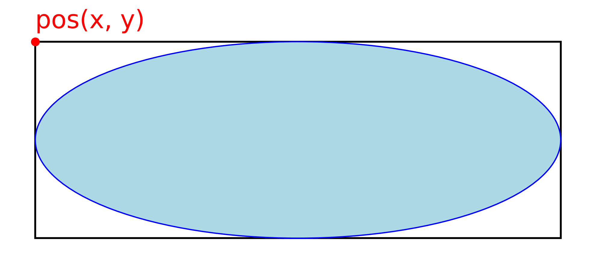

# Speed Test Application

A Python-based application to measure user clicking speed and accuracy.

## Overview

This application presents users with a series of clickable shapes on screen. The goal is to click on the highlighted shape (shown in light green) as quickly and accurately as possible within a time limit.

## Features
- Multiple shape types (Square, Circle, Rectangle, Triangle, Ellipse)
- Configurable tests
- Click logging with timestamps and accuracy data
- Export results to JSON or CSV format
- Visual editor to create and change configurations

## Quick Guide
1. Start the application by running `run_windows.bat` or `run_mac`, depending on your OS.
2. Select your preferred input device
3. Click the "Start" button on the canvas using your selected input method
4. Click on the highlighted shapes as quickly as possible
5. After the timer expires or stopping manually, export your results

## Running a Test
Start the application by running `run_windows.bat` or `run_mac`, depending on your OS. This will check if the python package installer `uv` is available, if not `uv` is installed. You might have to give permisson to do that. After installing, the application is started using `uv`. All dependencies are installed automatically by `uv` using the declaration in ``main.py``, no need for conda or venv.

Once the application is running, you can select an input device — the default is Mouse. Typically, you can choose between Mouse and Hand Tracking. If a gamepad is connected and recognized, the Gamepad option will appear as well.

Next, you can select a configuration via config → load config. This will open a file chooser, where you can select your preferred configuration file. Or you can choose a config shown in the dropdown menu. If you want to create a new configuration or modify an existing one, use the Editor mode described below.

To start the test, click the Start button in the center of the window. This must be done using the currently selected input device. The test will begin immediately. One of the shapes will be highlighted — when you click it, the next shape will be highlighted. The goal is to click as quickly and precisely as possible. The test ends automatically when the timer expires or it is stopped manually.

During the test, every click is recorded. Each click stores the following information:
- Timestamp
- ID of the highlighted shape
- X position of the click
- Y position of the click
- Hit status (whether you hit the highlighted shape or missed it)

You can export the recorded clicks at any time before starting a new test — once a new test begins, the previous data will be overwritten. Exports can be saved in JSON or CSV format. A file chooser will again allow you to select the desired export location.

## Editor Mode
The application includes a visual editor to create and modify test configurations:

1. Access the editor through Config -> Edit Config
2. In edit mode:
   - Right-click existing shapes to edit their properties or delete them
   - Right-click anywhere else on canvas to add new shapes
   - Left-click and drag to move shapes
   - Press the "Edit Timer..." button to adjust timer duration
   - Use undo/redo button to go back. You can also use "ctrl+z" / "ctrl+y" or "cmd+z" / "shift+cmd+z"
3. Save your configuration through Config -> Export Config or pressing "Save As...".
4. Load existing configurations through Config -> Load Config or by selecting them in the dropdown menu.  **Only configs inside the folder /config are shown in the dropdown menu**
 

### Available Shapes
The following shapes can be created and edited:
- Square
- Circle
- Rectangle
- Triangle
- Ellipse

#### Note on Position and Bounding Box
For all shapes, the `x` and `y` coordinates define the **top-left corner of the bounding box** that contains the shape. See the diagram below for clarification:

This convention ensures consistency across all shapes when positioning and interacting with them in the application.

## Input Devices
The application supports three input methods for clicking on shapes:

### Mouse Input
- Standard mouse cursor control
- Left-click to select shapes
- Real-time cursor position tracking
- Use this for touchpad or touchscreen inputs as well

### Hand Tracking
- Camera-based hand gesture recognition using MediaPipe
- Make a fist gesture to trigger clicks
- Hand position controls cursor movement
- Requirements:
  - Webcam
  - Well-lit environment
  - Single hand in frame
  - Hand should be clearly visible and at arm's length from camera

Tips for Hand Tracking:
- Keep your hand within the camera frame
- Make clear fist gestures for clicking
- Avoid rapid movements
- Ensure good lighting conditions
- Position yourself approximately 50-70cm from the camera

### Gamepad
- Analog stick for cursor movement
- Any face button (A/B/X/Y) for clicking
- Requirements:
  - **Must be plugged in before starting the application**
  - Compatible gamepad/controller
  - XInput / DirectInput support (Xbox-style controllers recommended)

Tips for Gamepad:
- Use small, precise stick movements
- Any face button works for clicking

## Requirements

- Python 3.x
- Required packages:
  - Tkinter (usually included with Python)
  - OpenCV (cv2)
  - Mediapipe
  - inputs (for gamepad support)

## Documentation
Check the folder "diagrams" for further documentation. Includes a class diagram and a 
sequence diagram for startup, written using meraid.

## Changelog

### v1.3.5
- bat and bash scripts for easy startup using uv, no need to install packages anymore
- inline package declaration in main.py for uv.

### v1.3.4
- main.py can now be run from any working directory
- Not starting in full screen anymore, cause of problems when screen zoom is on
- Gamepad only selectable if it is plugged in on application start
- Button to save the config in edit mode
- Dropdown menu showing all configurations in /config

### v1.3.3
- Added undo / redo funtionality for edit mode
- Added keybinds for undo / redo and to cancle or confirm dialogs

### v1.3.2
- Better drag and drop, updating while moving a shape now
- All shape positions are now the top left corner of the bounding box, for consistency

### v1.3.1
- Added export as csv for click log
- Adjusted json export to be consistant with csv (no nested structures)

### v1.3.0
- Added visual configuration editor
- Added drag & drop functionality for shapes
- Added shape creation and editing dialogs
- Added ability to delete shapes
- Added ability to set timer duration
- Added configuration export/import in editor mode
- Force mouse input during editing for precise control

### v1.2.0
- Added gamepad support as a new input device
- Application is now fullscreen

### v1.1.1
- Changed test start mechanism to use canvas button
- Test now starts using the currently selected input device
- Removed timer expiration popup as it was unnecessary and caused issues with test flow
- Added class and sequence diagrams as documentation (mermaid markdown)
- Added an indicator to the cursor, to show when left click is pressed

### v1.1.0
- Added strategy pattern for input device selection
- Added dropdown menu to select input device
- Implemented custom cursor on canvas for consistent interface across input devices
- Added hand tracking as an alternative input device
- Code refactoring and general improvements

### v1.0.0
- Initial release
- Basic shape clicking functionality
- Timer for tests
- Mouse input support
- JSON configuration system
- Basic results logging