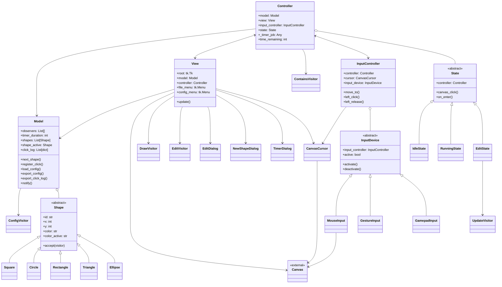

# Class Diagram
### Relations not drawn for simplicity:
**Visitors**: Used to visit a shape.  
**main.py**: Initializes MVC

```mermaid
classDiagram
    %% Core MVC Architecture
    View --> Model
    Controller --> Model
    Controller <--> View
    Controller --> ContainsVisitor
    Controller <--> InputController

    %% Model / Shape
    Model --> ConfigVisitor
    Model o-- Shape
    Shape <|-- Square
    Shape <|-- Circle
    Shape <|-- Rectangle
    Shape <|-- Triangle
    Shape <|-- Ellipse

    %% View Components
    View --> Canvas 
    View --> DrawVisitor
    View --> EditVisitor
    View --> EditDialog
    View --> NewShapeDialog
    View --> TimerDialog
    View --> CanvasCursor
    CanvasCursor --> Canvas

    %% State Pattern
    Controller o-- State
    State <|-- IdleState
    State <|-- RunningState
    State <|-- EditState

    %% Edit State
    EditState --> UpdateVisitor

    %% Input Handling
    InputController --> CanvasCursor
    InputController o-- InputDevice
    InputDevice <|-- MouseInput
    InputDevice <|-- GestureInput
    InputDevice <|-- GamepadInput
    MouseInput --> Canvas

    %% Visitors

    %% Key Classes
    class Model {
        +observers: List[]
        +timer_duration: int
        +shapes: List[Shape]
        +shape_active: Shape
        +click_log: List[dict]
        +next_shape()
        +register_click()
        +load_config()
        +export_config()
        +export_click_log()
        +notify()
    }

    class View {
        +root: tk.Tk
        +model: Model
        +controller: Controller
        +file_menu: tk.Menu
        +config_menu: tk.Menu
        +update()
    }

    class Controller {
        +model: Model
        +view: View
        +input_controller: InputController
        +state: State
        +_timer_job: Any
        +time_remaining: int
    }

    class State {
        <<abstract>>
        +controller: Controller
        +canvas_click()
        +on_enter()
    }

    class InputController {
        +controller: Controller 
        +cursor: CanvasCursor
        +input_device: InputDevice
        +move_to()
        +left_click()
        +left_release()
    }

    class InputDevice {
        <<abstract>>
        +input_controller: InputController
        +active: bool
        +activate()
        +deactivate()
    }

    class Shape {
        <<abstract>>
        +id: str
        +x: int
        +y: int
        +color: str
        +color_active: str
        +accept(visitor)
    }

    class Canvas {
        <<external>>
    }
```