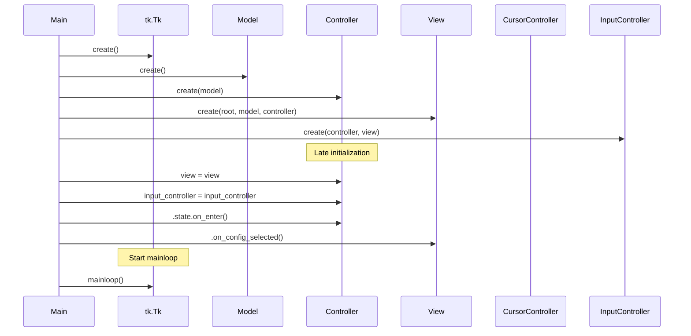

```mermaid
sequenceDiagram
    participant Main
    participant Root as tk.Tk
    participant Model
    participant Controller
    participant View
    participant CursorController

    Main->>Root: create()
    Main->>Model: create()
    Main->>Controller: create(model)
    Main->>View: create(root, model, controller)
    Main->>InputController: create(controller, view)
    
    Note over Controller: Late initialization
    Main->>Controller: view = view
    Main->>Controller: input_controller = input_controller
    Main->>Controller: .state.on_enter()
    Main->>View: .on_config_selected()
    
    Note over Root: Start mainloop
    Main->>Root: mainloop()
```